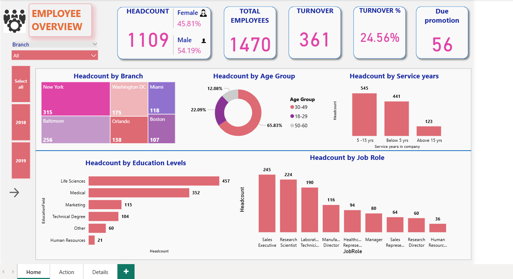
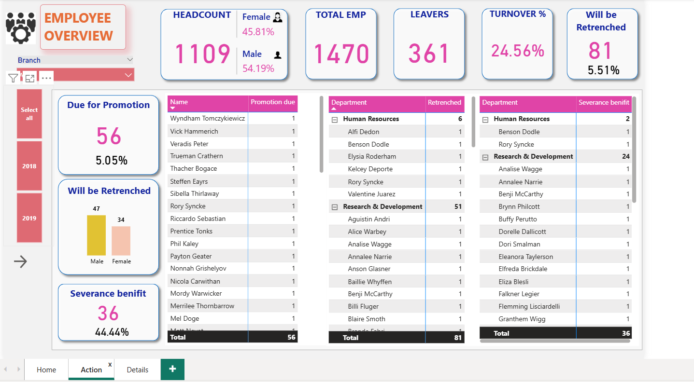
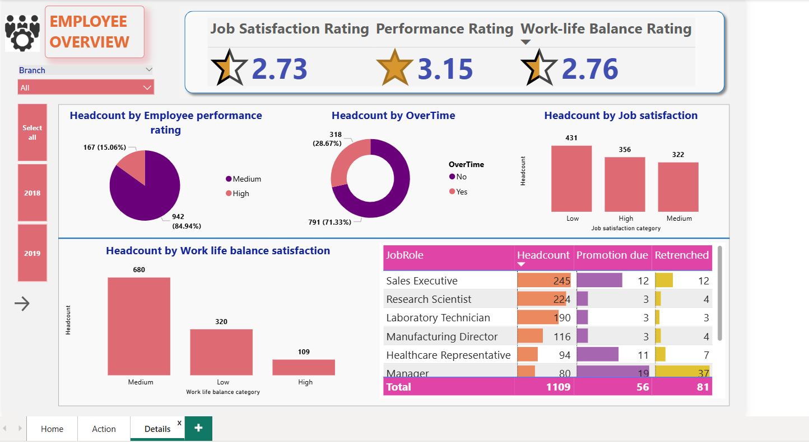

# HR Analytics: Understanding Employee Attrition and Workforce Trends

## Project Overview
This Power BI project focuses on analyzing employee attrition and workforce trends to help organizations understand employee turnover, retention risks, and overall workforce composition.  
The dashboard enables HR teams and management to make data-driven decisions related to employee engagement, promotions, and retention strategies.

---

## Tools & Technologies
- Power BI Desktop
- DAX (Data Analysis Expressions)
- CSV Dataset
- Data Modeling & Data Cleaning

---

## Key Business Questions Addressed
- What is the overall employee attrition and turnover rate?
- Which branches and departments have the highest headcount?
- How does attrition vary by age group, gender, job role, and service years?
- Which employees are due for promotion?
- Which employees are likely to be retrenched?
- How do job satisfaction, performance rating, and work-life balance impact employees?

---

## Dashboard Pages & Insights

### 1️⃣ Employee Overview
- Total employees, headcount, and turnover percentage
- Gender-wise employee distribution
- Headcount by branch, age group, service years, education level, and job role
- Identification of employees due for promotion

---

### 2️⃣ Action Analysis
- Employees due for promotion
- Employees marked for retrenchment
- Employees eligible for severance benefits
- Department-wise breakdown of retrenchment and severance

---

### 3️⃣ Employee Details & Satisfaction
- Average job satisfaction rating
- Performance rating distribution
- Work-life balance analysis
- Overtime impact on employee satisfaction
- Job role-wise analysis of promotion and retrenchment

---

## Dataset Description
The dataset contains employee-level HR data, including:
- Employee demographics (age, gender, education)
- Job role and department
- Branch and service years
- Performance rating and job satisfaction
- Work-life balance and overtime status
- Attrition, promotion, and retrenchment indicators

---

## Key Metrics & KPIs
- Total Employees
- Headcount
- Turnover Count & Turnover Percentage
- Employees Due for Promotion
- Employees to be Retrenched
- Employees Eligible for Severance

---

## How to Use This Dashboard
1. Download the `.pbix` file from this repository
2. Open it using **Power BI Desktop**
3. Use filters such as branch and year to explore different workforce segments
4. Navigate across pages for overview, action insights, and employee details

---

## Business Impact
This dashboard helps organizations:
- Identify high-risk attrition areas
- Improve workforce planning and succession management
- Enhance employee retention strategies
- Support HR decision-making with data-backed insights

---

