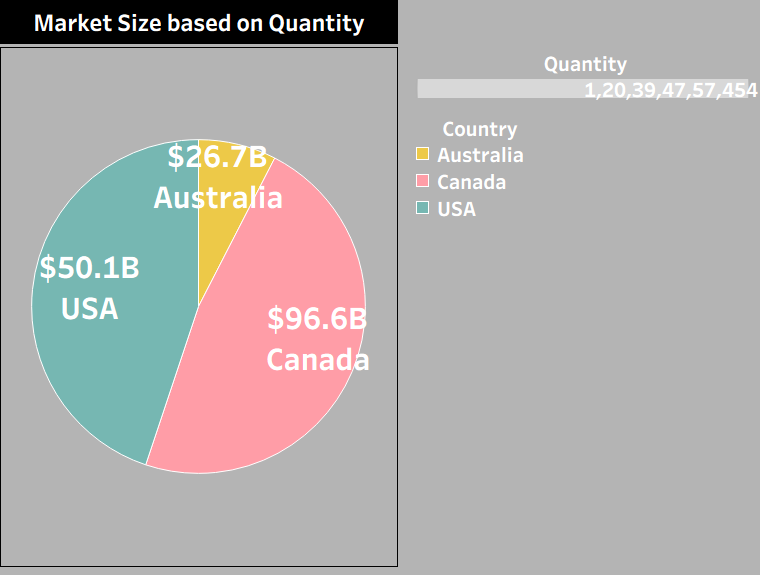
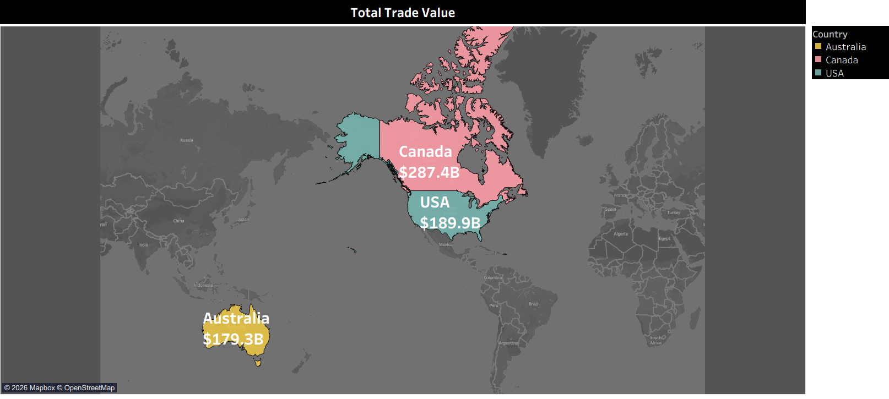
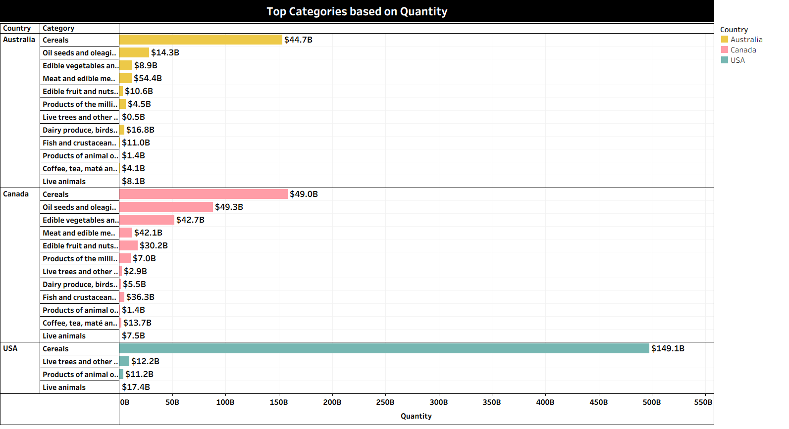
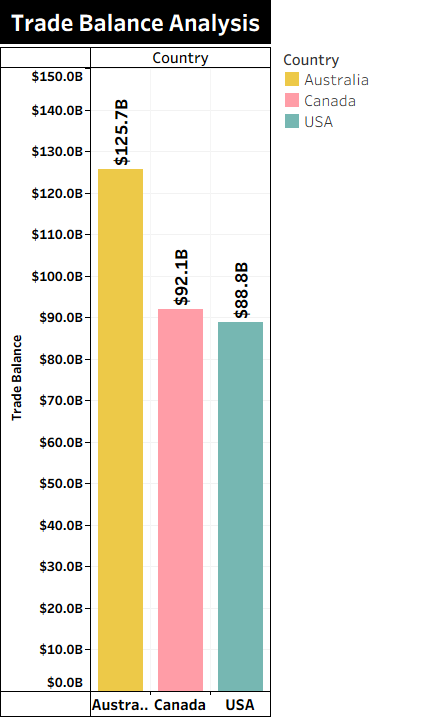

# Global Trade Analysis using Tableau

## Project Overview
This project presents an interactive **Global Trade Analysis dashboard** built using Tableau to analyze international trade patterns across countries, years, and product categories. The dashboard enables users to explore **market size, total trade value, top traded categories, and trade balance trends** through dynamic filters and visualizations.

The analysis focuses on three major countries:
- Canada
- Australia
- United States (USA)

The project demonstrates the use of Tableau for **economic analysis, trade performance evaluation, and comparative country-level insights**.

---

## Tools & Technologies
- Tableau Desktop
- Tableau Prep Builder (for data cleaning & preparation)
- Tableau Packaged Workbook (.twbx)
- Interactive Dashboards & Filters

---

## Dataset Information
The dataset contains global merchandise trade data including:
- Country
- Trade Flow (Import / Export)
- Product Categories
- Trade Value (USD)
- Trade Quantity
- Year (2011–2016)

📌 **Note:** The dataset is embedded within the Tableau Packaged Workbook (`.twbx`), so no separate dataset upload is required.

---

## Dashboard Overview
The main **Global Trade Analysis** dashboard integrates multiple visualizations into a single interactive view with:
- Trade flow selector (Import / Export)
- Country selector
- Year range slider
- Cross-filtering across all visuals

---

## Key Visualizations & Insights

### 1️⃣ Market Size based on Quantity
- Visualized using a pie chart
- Compares market size of countries based on trade quantity
- Highlights relative dominance of each country

**Insight:**
- Canada shows the largest market size
- USA follows, with Australia contributing a smaller share

---

### 2️⃣ Total Trade Value (Geographical Map)
- World map highlighting total trade value by country
- Provides geographic context to trade performance

**Insight:**
- Canada leads with the highest total trade value
- USA and Australia follow with comparatively lower values

---

### 3️⃣ Top Categories based on Quantity
- Horizontal bar chart showing top traded product categories
- Breaks down trade quantity by country and category

**Insight:**
- Cereals, edible vegetables, meat, and oil seeds dominate trade quantity
- Reveals high-volume but varying-value product categories

---

### 4️⃣ Trade Balance over Time
- Year-wise comparison of:
  - Total Export Value
  - Total Import Value
  - Trade Balance (Export − Import)
- Covers the period from 2011 to 2016

**Insight:**
- All three countries maintain a consistent trade surplus
- Export values remain higher than import values across years

---

### 5️⃣ Trade Balance Analysis (Country Comparison)
- Bar chart comparing overall trade balance by country

**Insight:**
- Australia has the highest trade balance
- Canada ranks second
- USA has the lowest trade balance among the three

---

## Key Insights Summary
- Canada dominates in total trade value and market size
- Australia leads in overall trade balance
- Cereals and agricultural products contribute significantly to trade volume
- Trade balances remain positive and stable over time
- The dashboard enables multi-dimensional trade analysis through interactive controls

---

## How to Use This Project
1. Download the `.twbx` file from the repository
2. Open it using **Tableau Desktop** or **Tableau Public**
3. Use filters to:
   - Select country
   - Switch between import and export flows
   - Adjust year range
4. Interact with visuals to explore global trade patterns

---

## Business Value
This project helps:
- Analyze international trade performance
- Compare countries based on trade metrics
- Identify high-impact product categories
- Support trade, economic, and policy-related decision-making

---

